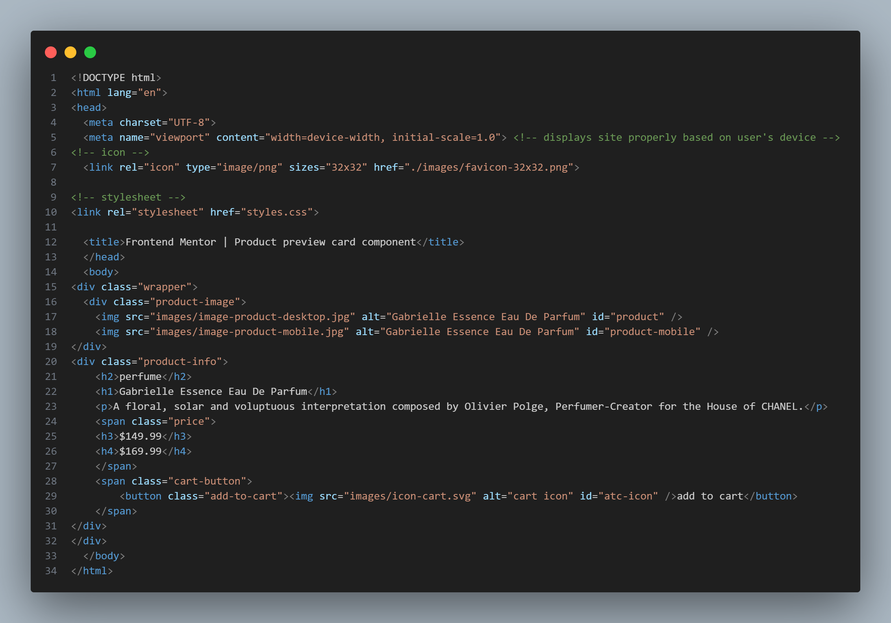

# Frontend Mentor - Product preview card component solution

This is a solution to the [Product preview card component challenge on Frontend Mentor](https://www.frontendmentor.io/challenges/product-preview-card-component-GO7UmttRfa). Frontend Mentor challenges help you improve your coding skills by building realistic projects. 

## Table of contents

- [Overview](#overview)
  - [The challenge](#the-challenge)
  - [Screenshot](#screenshot)
  - [Links](#links)
- [My process](#my-process)
  - [Built with](#built-with)
  - [What I learned](#what-i-learned)
  - [Continued development](#continued-development)
- [Author](#author)
- [Acknowledgments](#acknowledgments)

## Overview

### The challenge

Users should be able to:

- View the optimal layout depending on their device's screen size
- See hover and focus states for interactive elements

### Screenshot

![CSS] ** Note: Screenshot is too long to post directly, but it is located in the code-pics file **

### Links

- Solution URL: [GitHub](https://emileeeversole.github.io/FEM-Product-Preview/)

## My process

### Built with

- HTML5
- CSS

### What I learned

I normally work based on some source code or at least by referring back to something that I've written in the past. This time, however, I didn't allow myself to look at any other code. I really enjoyed looking at the pictures of the completed project and figuring out how to make it work. I feel that it was a good way to test my progress as I learn to code, and I'm excited to start the next project!

### Continued development

I will definitely continue to work on my CSS skills. I feel like, slowly, everything is coming together. However, I still struggle big-picture layouts and remembering how a property set within one element can effect another. I usually end up writing out all the code but it's a mess and some parts need to be tweaked, and then I write another page that's a little bit more organized. I hope to cut out that first page of code and learn to think ahead during the first go-around. 

## Author

- GitHub - [@EmileeEversole](https://github.com/EmileeEversole)
- Frontend Mentor - [@EmileeEversole](https://www.frontendmentor.io/profile/EmileeEversole)

## Acknowledgments

This is the first project that I'm publishing, but I have worked on quite a few others. Huge shoutout to my husband, Caleb, for listening to me ramble about my newest project/whatever I learned that day. Love you, darlin. 

